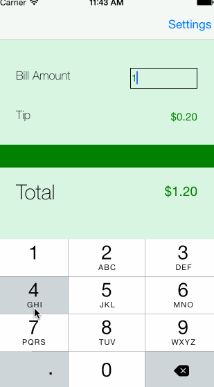

### iOS (Swift) tip calculator

#### How many hours did it take to complete?

About three hours.

#### Which required and optional stories have you completed?

- [x] Given a bill amount, calculate a tip and a total.
- [x] Dismiss keyboard on tap anywhere on screen.
- [x] Allow the user to choose the tip percentage.
- [x] Add a settings page that allows user to set default %

#### GIF demo

